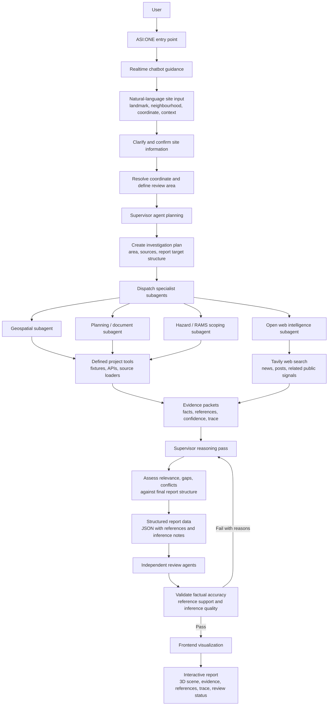
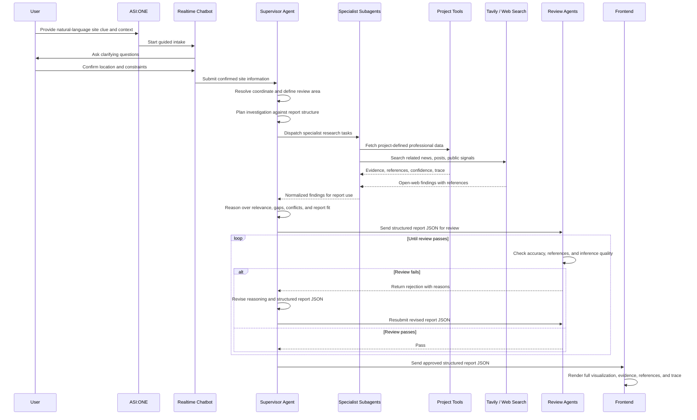

# ADR 0002: ASI:ONE Entry, Supervisor Planning, And Review-Gated Report Workflow

## Status

Accepted for workflow planning.

## Context

3D-RAMS needs an agent workflow that starts from a natural user description and ends with structured report data that can drive the frontend visualization. The user may provide a coordinate directly, a nearby landmark, a neighbourhood name, or other contextual clues that need clarification before the agent begins a formal site review.

The entry experience should be conversational. ASI:ONE is the intended user-facing entry point. It should guide the user through clarification and confirmation, ideally with a realtime model. Voice input would improve the experience, but it is not required for the first implementation.

Once the location and intent are confirmed, the system needs a supervisor-led workflow. The supervisor should define the review area, plan the investigation, dispatch specialist subagents, collect professional evidence through defined 3D-RAMS tools, use Tavily for open web signals such as news and posts, reason over relevance and gaps, then produce structured JSON report data. That JSON should not go straight to the frontend until independent review agents verify factual support and inference quality.

## Decision

Use ASI:ONE as the conversational intake and entry layer. Use a supervisor agent for planning, subagent dispatch, reasoning, report-structure alignment, and JSON assembly. Use specialist subagents for source-specific data collection and normalized evidence summaries. Use independent review agents as a gate before the structured report data is sent to the frontend.

The review gate should be iterative. If review agents reject the report JSON, they must return reasons to the supervisor. The supervisor then revises the reasoning and structured data before resubmission. The frontend receives the report only after review passes.

## Workflow Diagram

## Agent Loop Diagram

## Boundary Model

- ASI:ONE is the entry, intake, clarification, and confirmation layer.
- Because ASI:ONE cannot directly expose the AWS AgentCore runtime endpoint in the tested path, the first user-facing agent should be implemented in AgentVerse and should wake the AgentCore supervisor after intake confirmation.
- The realtime chatbot guides the user from ambiguous natural language toward confirmed review inputs.
- The supervisor agent owns planning, area definition, task dispatch, reasoning, gap analysis, and structured JSON assembly.
- Specialist subagents collect and summarize domain-specific evidence through defined 3D-RAMS tools and Tavily-backed open web search.
- Review agents independently verify accuracy, reference support, and inference quality before release.
- The frontend consumes only review-passed structured report data.

## Consequences

Positive:

- Keeps the user-facing entry flexible while preserving a structured backend workflow.
- Makes the review gate explicit before visualized report output.
- Keeps evidence, references, confidence, and trace data available for both review and frontend inspection.
- Gives the AWS migration a clearer target shape for supervisor runtime, subagent execution, tool calls, and review loops.

Tradeoffs:

- Requires a durable report JSON schema before implementation can be robust.
- Requires loop controls, timeout policy, and review-failure handling to avoid unbounded supervisor/reviewer cycles.
- Requires clear boundaries for Tavily/open-web findings so posts and news are treated as signals, not authoritative professional evidence.
- Requires careful safety language so the workflow remains a review pack, not certified RAMS, emergency guidance, or approval to work.

## Next Review Trigger

Revisit this decision when the team defines the report JSON schema, subagent list, tool contracts, and review harness. The next architecture pass should map this workflow onto the AgentCore deployment plan from ADR 0001.

## Implementation Update 2026-06-29

The practical entry chain is now:

`ASI:ONE user surface -> AgentVerse intake agent -> AgentCore supervisor runtime -> specialist tools/subagents -> review agents -> frontend visualization`.

This changes the first boundary from “ASI:ONE directly submits to supervisor” to “AgentVerse adapts the ASI:ONE interaction into the AgentCore supervisor invocation.” The supervisor and review workflow still belongs in AgentCore; AgentVerse should remain the entry and wake-up layer.
