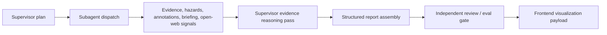

# ADR 0007: Supervisor Evidence Reasoning Pass

## Status

Proposed for implementation planning.

## Context

ADR 0002 defines the supervisor workflow as planning, specialist evidence collection, relevance reasoning, structured report assembly, and independent review. The current AgentCore runtime already has the core execution skeleton:

- planner phase;
- initial geospatial and planning subagent fan-out;
- hazard extraction;
- parallel annotation and briefing generation;
- safety/review guardrail;
- structured report assembly.

The current implementation does not yet have an explicit reasoning pass between evidence collection and structured report generation. Evidence, hazards, annotations, briefing text, and source metadata flow directly into the report builder. This is acceptable for deterministic Demo1 behavior, but it is not enough for the target workflow because the supervisor needs to decide:

- which facts are relevant to the final report structure;
- which findings are supported by evidence;
- which signals are weak, stale, or only contextual;
- what information is missing;
- what should be escalated to human review;
- what the review agent should verify.

This reasoning must be inspectable, but it must not expose hidden chain-of-thought. The output should be a structured decision artifact that explains evidence use, gaps, conflicts, and report inclusion decisions at a safe summary level.

## Decision

Add a mandatory supervisor evidence reasoning pass after specialist subagent outputs are collected and before structured report assembly.

The reasoning pass may be deterministic, mocked, or LLM-backed depending on runtime configuration, but it must not be omitted. In local and fixture-first modes, it should produce deterministic structured reasoning from available evidence. In cloud mode, it can call Bedrock or a future reasoning Harness, but it must preserve the same output contract.

The reasoning pass belongs inside the AgentCore supervisor workflow. It is not an AgentVerse entry-agent responsibility and should not be implemented in the frontend.

## Workflow Position



## Reasoning Contract

The supervisor should add a `reasoning` object to the run payload:

```json
{
  "reasoning": {
    "mode": "deterministic | llm | mock | fallback",
    "status": "ok | warning | fallback",
    "summary": "Short inspectable explanation of how evidence was used.",
    "reportFit": [
      {
        "sectionId": "planning-context",
        "status": "supported | partial | missing | conflict",
        "rationale": "Planning fixture supports contextual review, but live planning portal was not queried.",
        "sourceIds": ["public-lambeth-planning-context"],
        "evidenceIds": ["ev-lambeth-planning-context"],
        "confidence": "medium"
      }
    ],
    "findingAssessments": [
      {
        "findingId": "flood-context",
        "decision": "include | include_with_caveat | exclude | needs_review",
        "rationale": "Finding is supported by cached public flood-context evidence.",
        "sourceIds": ["public-ea-flood-context"],
        "evidenceIds": ["ev-lambeth-flood-context"],
        "confidence": "medium",
        "humanReviewRequired": true
      }
    ],
    "gaps": [
      {
        "id": "live-planning-check",
        "severity": "medium",
        "message": "Live planning portal was not queried in this run.",
        "affectsSections": ["planning-context"]
      }
    ],
    "conflicts": [],
    "reviewQuestions": [
      "Are the cached planning records still current for the intended survey date?"
    ]
  }
}
```

The reasoning object should be safe for UI display and logs. It should not include hidden model reasoning, raw chain-of-thought, private notes, secrets, or unsupported professional conclusions.

## Implementation Guidance

First implementation:

1. Add `supervisor_core/reasoning.py`.
2. Add `run_reasoning_pass(run_parts, config)` or equivalent.
3. Call it in `run_site_briefing` after briefing, annotation, review-input evidence, and future open-web signals are available.
4. Add a `reasoning` object to the returned run payload.
5. Update `structured_report.py` to use reasoning for:
   - report section statuses;
   - data-quality gaps;
   - finding confidence rationale;
   - review questions.
6. Add trace step `reason_over_evidence`.
7. Add tests proving the reasoning pass is always present, including no-Bedrock deterministic mode.

Future implementation:

- allow the planner to request a stronger LLM reasoning mode;
- optionally promote the reasoning pass into a dedicated `rams_reasoning_harness` only if it needs independent runtime controls;
- feed reasoning review questions into external eval or independent review agents.

## Non-Goals

- Do not expose hidden chain-of-thought.
- Do not claim certified RAMS, legal approval, emergency guidance, or approval to work.
- Do not make the reasoning pass depend on Tavily or other live sources.
- Do not block local Demo1 if Bedrock is unavailable.

## Consequences

Positive:

- Makes supervisor decisions inspectable instead of implicit.
- Gives the review gate a clear object to evaluate.
- Improves report quality without requiring live data sources.
- Creates a stable merge point for future Tavily/open-web signals.

Tradeoffs:

- Adds another required workflow phase.
- Requires report builder changes so reasoning is actually used, not only attached.
- LLM-backed reasoning needs deterministic fake responses in tests.

## Acceptance Criteria

- Every supervisor run includes `run.reasoning`.
- Trace includes `reason_over_evidence`.
- Structured report data-quality gaps and section statuses reflect reasoning output.
- Tests cover deterministic no-Bedrock reasoning.
- No hidden chain-of-thought, secrets, client data, or unsupported professional claims are emitted.

