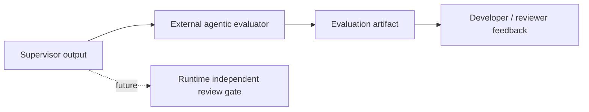

# ADR 0009: External Agentic Evaluation Harness

## Status

Proposed for implementation planning.

## Context

The current repository has deterministic evaluation scripts for Demo1 and local checks. These prove that the AgentCore runtime can generate expected fixture-backed outputs, preserve the safety boundary, and serve the frontend without AWS credentials.

ADR 0002 also calls for independent review agents to verify factual support and inference quality before report release. The current runtime has a safety gate and a `reviewGate` placeholder, but it does not yet have a full independent agentic review loop.

The project needs an intermediate capability: an external agentic evaluator that can inspect complete supervisor outputs and score them against a rubric. This should help the team improve reasoning, evidence support, safety language, and visualization readiness without immediately blocking the user-facing demo path.

## Decision

Add external agentic evaluation as a sidecar evaluation workflow before promoting it into the synchronous supervisor review gate.

The first implementation should run outside the user-facing request path. It should accept a saved or freshly generated supervisor output and produce an evaluation artifact. It may use a deterministic evaluator, mocked model responses, or an LLM-backed evaluator depending on environment configuration.

This is different from the in-workflow review gate:

- external agentic eval is for development, regression testing, and quality scoring;
- the review gate is for runtime release control.

The external evaluator can later become one input to the runtime review gate after its rubric and failure modes are stable.

## Evaluation Position



## Evaluation Contract

Input:

```json
{
  "run": {},
  "structuredReport": {},
  "expectedBehavior": {
    "mustStayWithinSafetyBoundary": true,
    "requiresVisualizationPayload": true,
    "requiresEvidenceReferences": true
  }
}
```

Output:

```json
{
  "schemaVersion": "3d-rams.agentic-eval.v1",
  "caseId": "case-or-run-id",
  "mode": "deterministic | llm | mock | fallback",
  "overall": {
    "status": "pass | warn | fail",
    "score": 0.82,
    "summary": "Report is visualization-ready, but open-web signals are absent and planning freshness needs review."
  },
  "rubric": [
    {
      "id": "evidence-support",
      "status": "pass",
      "score": 0.9,
      "findings": []
    },
    {
      "id": "unsupported-claims",
      "status": "pass",
      "score": 1.0,
      "findings": []
    },
    {
      "id": "data-gaps",
      "status": "warn",
      "score": 0.6,
      "findings": [
        {
          "severity": "medium",
          "message": "Live planning source freshness was not verified.",
          "traceIds": ["trace-load-planning-context"]
        }
      ]
    }
  ],
  "recommendedFixes": [
    "Surface planning freshness as a report limitation."
  ]
}
```

The evaluator output should be safe for public logs and CI artifacts. It should not contain secrets, private notes, hidden chain-of-thought, client data, or raw unredacted credentials.

## Initial Rubric

The first rubric should evaluate:

- evidence support for findings;
- references on findings and report sections;
- unsupported certified RAMS, emergency, legal, medical, financial, or approval-to-work claims;
- fixture/fallback/live-source disclosure;
- data gaps and stale-source warnings;
- visualization payload completeness;
- trace completeness;
- consistency between `run`, `structuredReport`, `delivery`, and `reviewGate`;
- open-web signal labeling when Tavily is enabled.

## Implementation Guidance

First implementation:

1. Add a repo-level runner such as `scripts/evaluate-agentic.py`.
2. Reuse the current supervisor runtime to generate a fixture-backed output when no input file is provided.
3. Add deterministic rubric checks first.
4. Add optional model-backed evaluator only behind explicit environment variables.
5. Write artifacts under `docs/evaluation-results/` or another existing evaluation output path.
6. Keep CI optional at first, or run only deterministic checks in CI.
7. Add tests for rubric scoring and unsafe claim detection.

Future implementation:

- add an `app/rams_eval_harness/` if the evaluator needs AgentCore Harness controls;
- feed evaluator findings into the runtime review gate;
- compare current output against previous accepted artifacts for regression detection;
- add scenario-specific expected outcomes.

## Non-Goals

- Do not block user-facing report generation in the first implementation.
- Do not replace the runtime review gate.
- Do not require live AWS, Tavily, or Bedrock for local deterministic checks.
- Do not produce certified compliance, legal approval, emergency guidance, or approval-to-work judgments.

## Consequences

Positive:

- Lets the team improve report quality in parallel with runtime workflow work.
- Creates measurable quality signals before the independent review loop is production-shaped.
- Keeps experimental evaluators out of the main demo path until stable.

Tradeoffs:

- Adds another artifact type to maintain.
- Model-backed evaluation may be nondeterministic and cost-bearing.
- The team must avoid treating eval pass as certified professional approval.

## Acceptance Criteria

- A local deterministic agentic eval can run without AWS credentials.
- Evaluation output includes pass/warn/fail status, rubric scores, and actionable findings.
- The evaluator checks evidence references, safety language, data gaps, visualization readiness, and trace completeness.
- Optional LLM-backed eval is explicit and environment-controlled.
- No secrets, private notes, hidden chain-of-thought, or unsupported professional claims are emitted.

