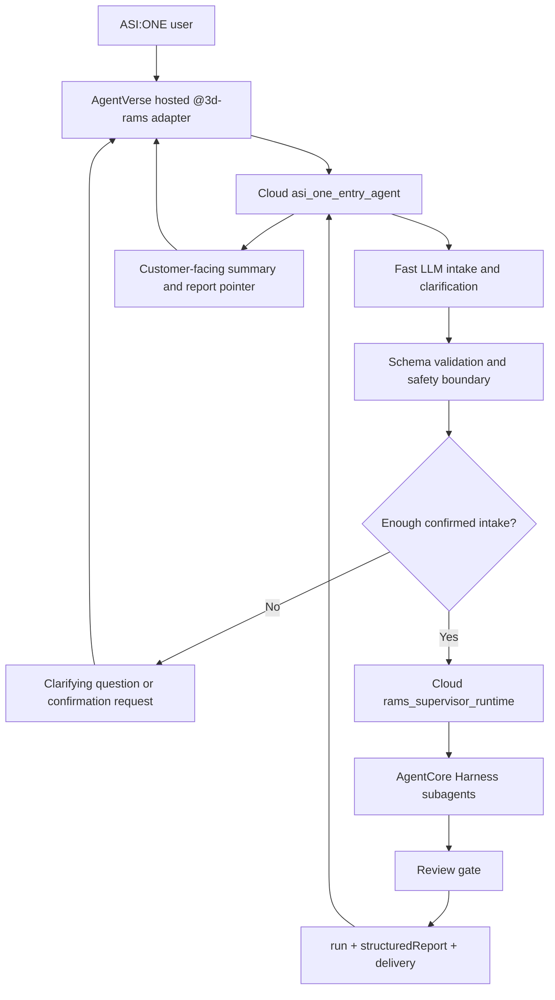

# ADR 0011: LLM-First AgentVerse Entry Experience

## Status

Proposed for implementation planning.

## Context

The AgentVerse `@3d-rams` hosted adapter can now invoke the cloud AgentCore `asi_one_entry_agent` runtime. The current path proves the integration boundary:

- AgentVerse sends a chat message to the hosted adapter.
- The hosted adapter signs and invokes the AgentCore entry runtime.
- The entry runtime returns an intake response.
- The entry runtime can later launch the supervisor runtime, which can orchestrate Harness subagents and return report payloads.

However, the currently active entry-turn path is not yet LLM-first. For `entryTurn` payloads, the cloud entry runtime primarily uses a deterministic structured intake coordinator. This is useful for stable tests and early cloud smoke, but it is not the final ASI:ONE user experience described in ADR 0002 and ADR 0005.

The expected product behavior is a fast conversational entry agent that can:

- interpret natural language flexibly;
- ask targeted clarifying questions;
- produce a confirmation-ready structured intake;
- present confirmation controls or clear confirmation text;
- launch the AgentCore supervisor only after enough information is confirmed;
- return a concise customer-facing delivery summary after the supervisor finishes.

The deterministic coordinator should remain available as a fallback and test harness, but it should not define the default ASI:ONE entry experience.

## Decision

Make the AgentVerse/ASI:ONE entry experience LLM-first while keeping supervisor orchestration in AgentCore.

The cloud `asi_one_entry_agent` will use a fast Bedrock-backed model for entry intake, clarification, and confirmation. The model must produce strict structured JSON that is validated before any supervisor launch. The deterministic parser and state machine remain as fallback logic for tests, local debug, and model failure.

The entry agent is responsible for user-facing interaction quality. The supervisor remains responsible for deep site reasoning, subagent orchestration, review gates, structured report generation, and report persistence.

## Runtime Boundary



## Entry Agent Contract

The entry agent should accept chat-style input from AgentVerse and frontend callers:

```json
{
  "entryTurn": true,
  "caller": "agentverse",
  "conversationId": "conversation-id",
  "entryAgentId": "@3d-rams",
  "message": "I want to visit 8 Albert Embankment tomorrow for a 2km survey.",
  "confirmedByUser": false,
  "runtimeOptions": {
    "fixturePack": "public-lambeth-thames",
    "useBedrock": true,
    "includePlanningFixture": true
  }
}
```

The LLM intake step must return one of three validated states:

```json
{
  "status": "clarification_required | confirmation_required | launch_ready",
  "assistantMessage": "Short user-facing response.",
  "clarifyingQuestions": [],
  "confirmation": {
    "summary": "Confirmable site and scope summary.",
    "actions": ["confirm", "revise"]
  },
  "intake": {
    "locationText": "8 Albert Embankment",
    "locationCandidate": {
      "label": "8 Albert Embankment",
      "lat": 51.492099,
      "lng": -0.118712,
      "confidence": 0.85
    },
    "areaScope": {
      "type": "radius",
      "meters": 2000
    },
    "userGoal": "survey pre-visit review",
    "userNotes": "Visit tomorrow.",
    "materials": []
  }
}
```

The entry agent must not invoke the supervisor unless:

- `status` is `launch_ready`;
- the user has confirmed the structured intake;
- the structured intake passes schema validation;
- the request stays within the safety boundary for a non-certified pre-visit briefing.

## Model Policy

The default entry model should optimize for latency and structured extraction, not deep reasoning. Deep reasoning belongs in the supervisor runtime.

Recommended configuration:

```bash
ENTRY_INTAKE_MODE=llm_first
ENTRY_INTAKE_MODEL_ID=<fast-bedrock-model-id>
ENTRY_INTAKE_FALLBACK=deterministic
ENTRY_INTAKE_MAX_RETRIES=1
ENTRY_INTAKE_TIMEOUT_SECONDS=20
```

When the LLM path fails, times out, or emits invalid JSON, the entry agent should:

- fall back to deterministic intake if safe;
- avoid launching the supervisor from invalid model output;
- return a clear clarification message if the fallback cannot resolve the request.

## UI And AgentVerse Experience

The entry response should be chat-appropriate by default:

- no raw JSON in normal ASI:ONE chat;
- concise questions when information is missing;
- a confirmation summary before launch;
- short completion summary after supervisor pass;
- clear human-review and non-certified safety boundary.

Structured JSON remains available to frontend/proxy callers that need report visualization payloads.

## Relationship To Existing ADRs

- ADR 0002 defines the overall ASI:ONE-to-supervisor-to-review workflow.
- ADR 0004 defines the AgentVerse adapter boundary.
- ADR 0005 defines the unified LLM intake and case-correlated workflow.
- This ADR narrows the implementation requirement for the entry experience now that the cloud AgentVerse-to-AgentCore connection is working.

ADR 0005 remains valid. This ADR clarifies that deterministic intake is no longer sufficient for the default ASI:ONE product path.

## Implementation Plan

1. Add an explicit `ENTRY_INTAKE_MODE` switch in `app/asi_one_entry_agent`.
2. Implement an LLM intake adapter that calls a fast Bedrock model and requests strict JSON.
3. Validate LLM output against the entry intake schema before state changes or supervisor invocation.
4. Preserve the deterministic coordinator as fallback and local test mode.
5. Store pending confirmed-intake state per `conversationId`.
6. Return chat-ready text to AgentVerse and structured payloads to frontend callers.
7. Add tests with fake model outputs for clarification, confirmation, launch-ready, invalid JSON, and fallback behavior.
8. Update AgentVerse hosted adapter docs so normal chat does not show raw JSON.

## Acceptance Criteria

- AgentVerse chat can handle natural language site/scope/goal input without requiring rigid phrasing.
- Missing required fields produce targeted clarifying questions.
- Complete input produces a confirmation-ready summary.
- Supervisor launch only happens after user confirmation.
- Invalid model output cannot launch the supervisor.
- Deterministic intake remains available for tests and explicit fallback.
- AgentVerse chat receives concise text, not raw JSON, in normal operation.

## Non-Goals

- Do not move supervisor planning, subagent dispatch, review, or report assembly into AgentVerse.
- Do not make AgentVerse responsible for AWS IAM, Harness orchestration, or report persistence.
- Do not claim certified RAMS, emergency guidance, legal approval, or approval-to-work.
- Do not commit model credentials, AWS credentials, AgentVerse keys, runtime ARNs, account ids, or private user data.

## Consequences

Positive:

- The public entry agent behaves like a real conversational product surface.
- The supervisor receives cleaner confirmed intake.
- ASI:ONE and frontend entry paths can converge on the same contract.

Tradeoffs:

- More LLM-path tests and schema validation are required.
- Cloud entry runtime needs model configuration and timeout handling.
- Some nondeterminism enters the entry experience, so fallback behavior must stay explicit.
