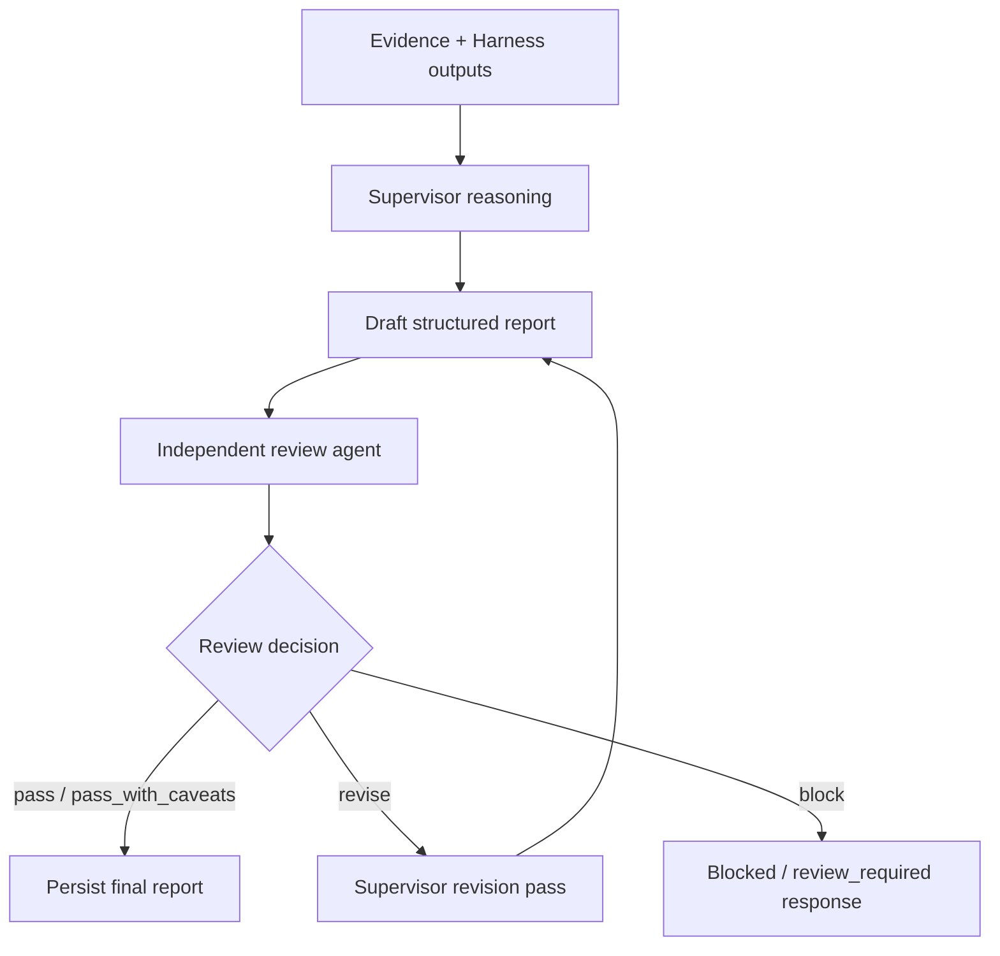

# ADR 0019: Independent Review Agent Loop

## Status

Proposed for implementation planning.

## Context

ADR 0002 defines the target workflow as:

1. ASI:ONE/AgentVerse entry intake;
2. supervisor planning;
3. specialist subagent evidence collection;
4. supervisor reasoning and structured report assembly;
5. independent review agent;
6. pass or return to supervisor for revision;
7. frontend visualization and delivery summary.

ADR 0007 adds the supervisor evidence reasoning pass. ADR 0017 proposes a stable Harness output contract. The current implementation has review-related pieces, including a review guardrail and report safety status, but it does not yet implement a true independent review loop that can reject a draft and force supervisor revision.

The team needs to decide whether review is advisory metadata or a blocking workflow gate. This decision affects supervisor orchestration, report persistence, frontend state, and external evaluation.

## Decision

Implement independent review as a blocking workflow gate for publishable deep reports.

The supervisor may assemble a draft structured report, but the final delivery payload should only be considered report-ready after an independent review agent returns `pass` or `pass_with_caveats`.

If the review agent returns `revise`, the supervisor must perform a bounded revision pass using the review findings. If the review agent returns `block`, the workflow must stop and return a blocked or review-required response instead of a normal deep report.

The first implementation may use a deterministic or Harness-backed reviewer, but the review loop shape must be the same as the future LLM-backed review agent.

## Workflow



## Review Input Contract

The review agent should receive only bounded, inspectable artifacts:

```json
{
  "schemaVersion": "3d-rams.review-input.v1",
  "caseId": "case_id",
  "intake": {},
  "structuredReport": {},
  "reasoning": {},
  "evidenceRegister": {},
  "traceSummary": [],
  "safetyBoundary": {
    "nonCertifiedRams": true,
    "requiresHumanReview": true
  }
}
```

The review agent should not receive hidden chain-of-thought, credentials, raw private materials, signed URLs, or unbounded source dumps.

## Review Output Contract

```json
{
  "schemaVersion": "3d-rams.review-output.v1",
  "reviewer": {
    "name": "review_guardrail",
    "mode": "deterministic | harness | llm | fallback"
  },
  "decision": "pass | pass_with_caveats | revise | block",
  "status": "ok | warning | blocked | fallback",
  "summary": "Short review summary for UI and logs.",
  "issues": [
    {
      "id": "unsupported-finding",
      "severity": "low | medium | high | blocking",
      "message": "Finding lacks source references.",
      "affects": ["findings.hazard_1"],
      "requiredAction": "add_reference | downgrade_confidence | remove_finding | add_caveat"
    }
  ],
  "requiredRevisions": [],
  "caveats": [],
  "trace": []
}
```

## Loop Policy

- Maximum revision attempts: `2` by default.
- A second `revise` after the maximum attempts becomes `review_required`.
- A `block` decision stops the workflow immediately.
- `pass_with_caveats` allows delivery, but caveats must be visible in `structuredReport.reviewGate` and the frontend.
- Review output must be persisted with the case.

## Revision Policy

The supervisor revision pass may:

- remove unsupported findings;
- downgrade confidence;
- add caveats;
- add data-quality gaps;
- request missing source references from already available evidence;
- update report sections to reflect review findings.

The revision pass must not:

- invent new evidence;
- hide review objections;
- remove safety caveats to make the report look cleaner;
- launch unbounded new research unless a future ADR explicitly allows review-triggered re-planning.

## Relationship To Existing ADRs

- ADR 0002 defines the review-gated workflow.
- ADR 0007 gives the reviewer a reasoning object to evaluate.
- ADR 0017 gives the reviewer stable Harness output and evidence fields.
- ADR 0018 defines failure and fallback behavior for LLM-backed review.
- ADR 0016 hosted smoke should eventually assert a review result in the report payload.

## Consequences

Positive:

- Makes review a real workflow control, not just a report note.
- Gives frontend users clearer report status.
- Creates a clean boundary for future external evaluation.
- Reduces risk of unsupported findings appearing as final output.

Tradeoffs:

- Adds latency and orchestration complexity.
- Requires report drafts and final reports to be distinguishable.
- Requires tests for pass, revise, block, and max-revision behavior.

## Acceptance Criteria

- The supervisor produces a draft report before independent review.
- Final report payloads include `reviewGate` with review decision, status, issues, caveats, and revision count.
- `revise` causes at least one bounded supervisor revision pass.
- `block` prevents normal deep-report delivery.
- Maximum revision attempts are enforced.
- The frontend can distinguish `passed`, `passed_with_caveats`, `review_required`, and `blocked`.
- Tests cover deterministic review pass, revise, block, and max-revision behavior.

## Non-Goals

- Do not implement human approval workflows in this ADR.
- Do not perform certified RAMS approval.
- Do not expose hidden chain-of-thought or raw private material.
- Do not let the reviewer trigger unbounded live web or planning research in the first implementation.
