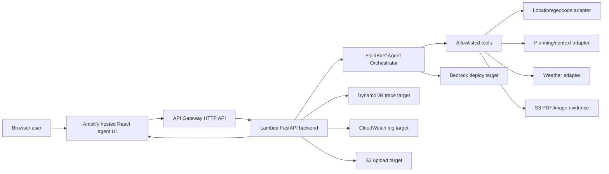

# Hosted AWS Product Path

3D-RAMS is being rebuilt as a hosted browser-based pre-visit agent product. The intended tester path is a normal URL, not Codespaces, local Python, Node, or AWS CLI.

## Target Experience

The user opens the hosted frontend, enters a shared test access code, then asks in natural language:

> I want to go for a site visit at 8 Albert Embankment tomorrow. Please prepare a pre-visit RAMS-style review pack.

The backend runs the agent workflow server-side and returns:

- assistant response;
- 3D site risk scene;
- risk review cards;
- evidence register;
- tool trace;
- confidence/fallback notes;
- safety gate result;
- RAMS-style review pack for human review.

The product does not produce certified RAMS, emergency guidance, work approval, or a competent-person replacement.

## AWS Architecture



## Current Implementation Status

Implemented locally:

- chat-first React product surface;
- session start endpoint with shared-code access model;
- hosted-style `/api/chat` endpoint;
- upload metadata and S3 presign adapter with local mock fallback;
- in-memory session trace with DynamoDB adapter path;
- Lambda adapter via Mangum;
- Strands-ready backend dependency and orchestrator boundary, with existing deterministic tools still used as the current execution core;
- server-side Bedrock/fallback boundary;
- visible map, evidence, trace, risk, and safety panels.

Not yet deployed:

- Amplify frontend;
- API Gateway HTTP API;
- Lambda function;
- S3 upload bucket;
- DynamoDB session table;
- CloudWatch dashboard/log queries;
- hosted Bedrock smoke test.

## Security And Cost Boundaries

- Bedrock is called only from the backend.
- No AWS credentials are sent to the frontend.
- Shared access code is checked before model calls.
- Unauthorized requests must return `401`.
- CORS should allow only the Amplify URL and local dev URLs.
- S3 uploads should use private bucket access and lifecycle deletion.
- DynamoDB stores run metadata, not raw credentials or private documents.
- CloudWatch logs should avoid uploaded file contents and access codes.
- Keep Bedrock use bounded by budget, max tokens, low temperature, and model-call cap.

## MVP Environment Variables

Backend:

```bash
APP_ENV=hosted
ALLOWED_ORIGINS=https://your-amplify-domain.example
APP_ACCESS_TOKEN_HASH=<sha256 access code hash>
APP_ACCESS_CODE_LABEL=team-test
ENABLE_BEDROCK=true
AWS_REGION=eu-west-2
BEDROCK_MODEL_ID=anthropic.claude-3-7-sonnet-20250219-v1:0
BEDROCK_MAX_TOKENS=1200
BEDROCK_TEMPERATURE=0.2
BEDROCK_MAX_MODEL_CALLS=1
S3_UPLOAD_BUCKET=<private evidence bucket>
DYNAMODB_SESSION_TABLE=<session trace table>
UPLOAD_RETENTION_DAYS=7
```

Generate the access-code hash locally and store only the hash in backend settings:

```bash
python -c "import hashlib; print(hashlib.sha256('replace-with-private-test-code'.encode()).hexdigest())"
```

Do not commit the raw access code or the real hash if it identifies a live test environment.

Frontend:

```bash
VITE_API_BASE_URL=https://your-api-gateway-domain.example
VITE_CESIUM_ION_TOKEN=
```

## Deployment Gates

1. Local chat-agent contract passes.
2. Backend is deployed behind API Gateway and blocks unauthorized requests.
3. Amplify frontend calls hosted backend.
4. Teammate test pack uses URL + access code only.
5. CloudWatch/DynamoDB evidence is reviewed before stronger production-readiness claims.

## Deferred

- Cognito login;
- AgentCore Observability;
- Google Earth / Google 3D tiles;
- full planning-portal scraping;
- news/live incidents;
- grid/infrastructure hazard feeds;
- certified RAMS document generation.
